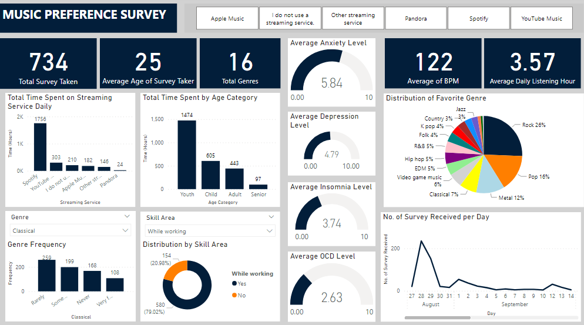

# Music Preference Survey Analysis

## Overview:
This project analyzes the results of a music preference survey challenge practice provided by the Brite.ai data community. The survey was conducted between August 7th and November 9th, collecting responses from 734 participants across 16 different genres of music. The analysis aims to uncover insights into participant demographics, music consumption habits, platform preferences, and mental health indicators.

## Key Findings:
- **Demographics:** The average age of survey respondents was 25 years, with youths being the predominant age group participating in the survey.
- **Platform Usage:** Spotify emerged as the most popular streaming service, followed by YouTube, Apple Music, and others.
- **Genre Preferences:** Rock music was the top preference among respondents, followed by pop, metal, and classical genres.
- **Mental Health Insights:** The survey revealed average anxiety, depression, insomnia, and OCD levels among respondents.
- **Listening Habits:** A significant majority of respondents reported listening to music while working, and a notable percentage identified as instrumentalists and exploratory in their music preferences.

## Repository Structure:
- `Dashboard.png`: Contains the image for the report.
- `Data Preprocessing.ipynb`: The notebook detailing the data cleaning, exploration and analysis processes.
- `Key Findings.docx`: Contains summary of the key findings from the analysis of the survey.
- `Music Preference Survey.pbix`: Contains dashboard created using Microsoft Power BI.
- `mxmh_survey_rsults.csv`: The raw data files provided by Brite.ai for the challenge practice.
- `README.md`: This file, providing an overview of the project and key findings.
- `survey_result.csv`: The processed version of the raw data file provided for the analysis

## Analysis Tools:
- Python (Pandas, Matplotlib, Seaborn) for data cleaning, exploration, and visualization.
- Jupyter Notebook for interactive data analysis and documentation.
- Microsoft Power BI for Dashboard creation.

## Contributors:
- [Adeniyi Fajemisin](https://github.com/neecrownsmith): Project Lead, Data Analyst

## Report Image:

